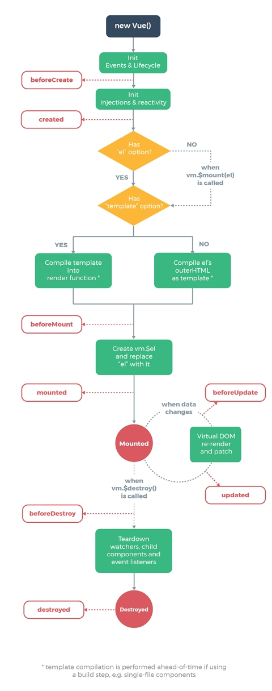

# Vue instance

## Vue 인스턴스 생성

모든 Vue vm은 Vue 생성자 함수로 root Vue 인스턴스를 생성하여 부트스트래핑된다.

```js
var vm = new Vue({
  // 옵션
})
```

Vue 인스턴스를 인스턴스화 할 때는 데이터, 템플릿, 마운트할 엘리먼트, 메소드, 라이프사이클 콜백 등의 옵션을 포함 할 수 있는 options 객체를 전달 해야한다.

Vue 생성자는 미리 정의 된 옵션으로 재사용 가능한 컴포넌트 생성자를 생성하도록 확장 할 수 있다.
모든 Vue 컴포넌트는 본질적으로 확장된 Vue 인스턴스이다.

## 속성과 메소드

각 Vue 인스턴스는 data 객체에 있는 모든 속성을 프록시 처리한다.

```js
// 데이터 객체
var data = { a: 1 }

// Vue인스턴스에 데이터 객체를 추가합니다.
var vm = new Vue({
  data: data
})

// 같은 객체를 참조합니다!
vm.a === data.a // => true

// 속성 설정은 원본 데이터에도 영향을 미칩니다.
vm.a = 2
data.a // => 2
```

데이터가 변경되면 화면은 다시 렌더링된다.
data에 있는 속성들은 인스턴스가 생성될 때 존재한 것들만 반응형이다.

따라서 인스턴스 생성 이후 새 속성을 추가하면: `vm.b = 'hi'`

b가 변경되어도 화면은 갱신되지 않는다.
어떤 속성이 나중에 필요하다는 것을 알고 있으며, 빈 값이거나 존재하지 않은 상태로 시작한다면 미리 초기값을 지정해서 객체를 생성해야 한다.

만약 Object.freeze ()를 사용하면, 기존 속성이 변경되는 것을 막아 반응성 시스템이 데이터를 추적하지 않게 한다.

```js
var obj = {
  foo: 'bar'
}

Object.freeze(obj)

new Vue({
  el: '#app',
  data: obj
})
```

## 인스턴스 데이터

### props (단방향 데이터 흐름)

모든 props는 하위 속성과 상위 속성 사이의 단방향 바인딩을 형성함 (부모 컴포넌트 -> 자식 컴포넌트)

1. `v-bind:`를 `:`로 단축하여 사용할 수 있음
2. js의 CamelCase는 html에서 kebab-case로 사용할 수 있음
3. 하위 컴포넌트에서 해당 바인딩을 props로 받을 수 있음 (하위 컴포넌트에서 수정불가-단방향 데이터 흐름)

자바 스크립트의 객체와 배열은 참조로 전달되므로 prop가 배열이나 객체인 경우
하위 객체 또는 배열 자체를 부모 상태로 변경하면 부모 상태에 영향을 준다.

자세한 내용은 Vue Component에서 다룸

#### props 단순예제

자식 컴포넌트를 정의

```js
Vue.component('child', {
  props: ['myMessage'],
  template: '<span>{{ myMessage }}</span>'
})
```

부모 컴포넌트에서 자식컴포넌트를 호출하고 props를 사용

```html
<div>
  <input v-model="parentMsg">
  <br>
  <child v-bind:my-message="parentMsg"></child>
</div>
```

객체의 모든 속성을 `props`로 전달하려면, 인자없이 `v-bind`를 사용하면 된다 (`v-bind:prop-name` 대신 `v-bind`)

#### props를 데이터 처리 인스턴스 method에서 활용

prop의 초기 값을 초기 값으로 사용하는 로컬 데이터 속성을 정의

```js
props: ['initialCounter'],
data: function () {
  return { counter: this.initialCounter }
}
```

prop 값으로 부터 계산된 속성을 정의

```js
props: ['size'],
computed: {
  normalizedSize: function () {
    return this.size.trim().toLowerCase()
  }
}
```

### data 객체

각각의 Vue 인스턴스는 data 객체의 모든 속성을 프록시 처리한다.
데이터 속성 외에도 유용한 인스턴스 속성 및 메소드가 있고,
이 프로퍼티들과 메소드들은 $ 접두사로 프록시 데이터 속성과 구별하여 호출가능하다.

```js
var data = { a: 1 };
var vm = new Vue({
  el: '#app',
  data: data
});

vm.a === data.a; // true
vm.$data === data; // true
vm.$el === document.getElementById('app'); // true
// $watch 는 인스턴스 메소드 입니다.
vm.$watch('a', function (newVal, oldVal) {
  // `vm.a`가 변경되면 호출 됩니다.
});
```

### computed (계산된 속성)

표현식은 유지보수성을 위해서 단순한 연산에만 사용하고, 복잡한 결과도출을 위해서는 계산된 속성을 사용해야 한다.

계산된 속성은 종속성(아래의 경우 message) 중 일부가 변경된 경우에만 다시 계산된다.
따라서 이후에 reversedMessage에 접근하면 캐싱된 값을 반환받는다. 만약 캐싱호출을 원하지 않는다면 reversedMessage() 메소드를 호출하면 된다.

```js
var vm = new Vue({
  el: '#app',
  data() {
    return {
      message: '안녕하세요'
    };
  },
  computed: {
    // 계산된 getter
    reversedMessage() {
      // this는 vm 인스턴스
      return this.message.split('').reverse().join('');
    }
  }
});
```

```html
<div id="app">
  <p>원본: {{ message }}</p>
  <p>계산된 값: {{ reversedMessage }}</p>
</div>
```

계산된 속성은 필요한 경우 setter를 사용할 수도 있다.

```js
// ...
  computed: {
    fullName: {
      get() {
        return this.firstName + ' ' + this.lastName;
      },
      set(newValue) {
        var names = newValue.split(' ');
        this.firstName = names[0];
        this.lastName = names[names.length - 1];
      }
    }
  }
// ...
vm.fullName = 'Sand Park';
// 실행하면 vm.firstName === 'Sand', vm.lastName === 'Park'
```

### watch (감시된 속성)

Vue는 인스턴스 데이터변경을 관찰하고 이에 반응하는 보다 일반적인 속성감시방법을 제공한다.
하지만 watch 콜백보다는 계산된 속성을 사용하는 것이 더 좋다.

```js
var vm = new Vue({
  data() {
    return {
      firstName: 'Foo',
      lastName: 'Bar',
      fullName: 'Foo Bar'
    };
  },
  watch: {
    firstName(val) {
      this.fullName = val + ' ' + this.lastName;
    },
    lastName(val) {
      this.fullName = this.firstName + ' ' + val;
    }
  }
});
```

감시된 속성을 사용하면 데이터 변화를 적용하기 위해 이미 존재하는 속성에 접근 (this) 해야 한다. 계산된 속성을 이용하면 코드를 줄일 수 있다.

```js
var vm = new Vue({
  data() {
    return {
      firstName: 'Foo',
      lastName: 'Bar'
    };
  },
  computed: {
    fullName() {
      return this.firstName + ' ' + this.lastName;
    }
  }
});
```

## 인스턴트 라이프사이클 훅

각 Vue 인스턴스는 데이터 관찰을 설정하고, 템플릿을 컴파일하고, 인스턴스를 DOM에 마운트하고, 데이터가 변경 될 때 DOM을 업데이트해야 할 때 일련의 초기화 단계를 거칩니다. 그 과정에서 사용자 정의 로직을 실행할 수있는 라이프사이클 훅 도 호출됩니다. 예를 들어, created 훅은 인스턴스가 생성된 후에 호출됩니다. 예:

> options 속성이나 콜백에 created: () => console.log(this.a) 이나 vm.$watch('a', newValue => this.myMethod()) 와 같은 화살표 함수 사용을 지양하기 바랍니다.
화살표 함수들은 부모 컨텍스트에 바인딩되기 때문에, this 컨텍스트가 호출하는 Vue 인스턴스에서 사용할 경우 Uncaught TypeError: Cannot read property of undefined 또는 Uncaught TypeError: this.myMethod is not a function와 같은 오류가 발생하게 됩니다.



created, mounted, updated, destroyed ...

1. new Vue()
1. `beforeCreate()`
1. Initialize Data & Events
1. Instace created
1. `created()`
1. Compile template or el's template
1. `beforeMount()`
1. replace el with compiled template
1. Mounted to DOM
1. `mounted()`
1. dataChanged
1. `beforeUpdate()`
1. re-render DOM
1. `updated()`
1. `beforeDestory()`
1. destroyed
1. `destroyed()`

```js
var vm = new Vue({
  data() {
    return {
      a: 1
    };
  },
  created() {
    // `this` 는 vm 인스턴스를 가리킵니다.
    console.log('a is: ' + this.a)
  }
})
// -> "a is: 1"
```
